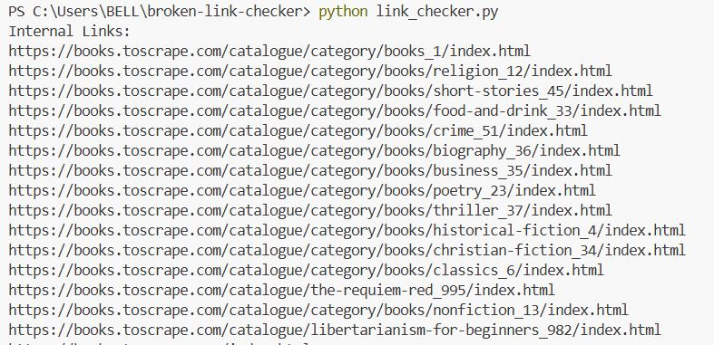
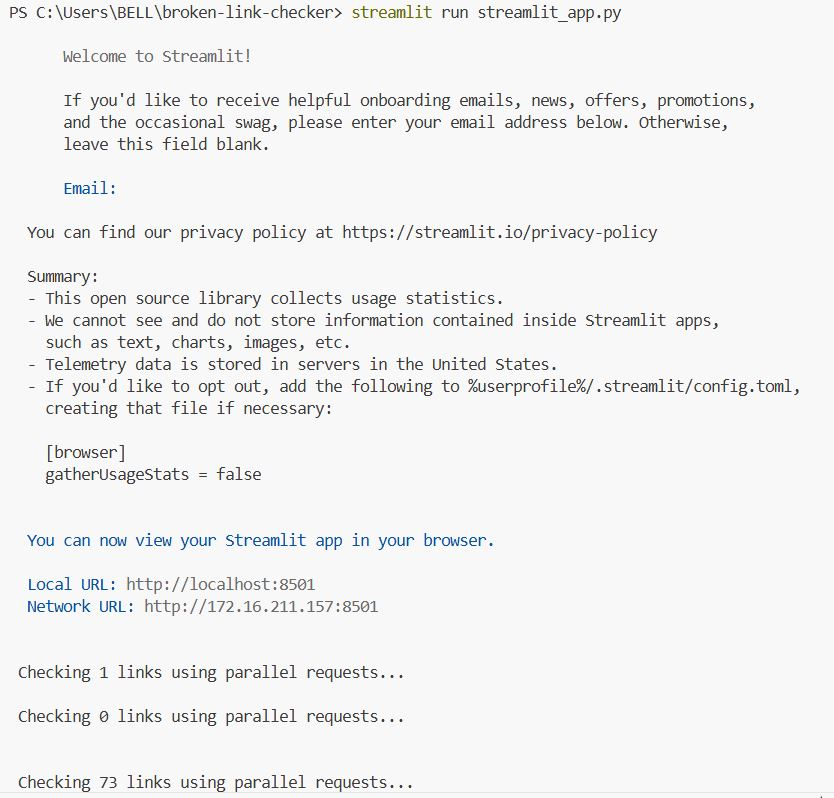
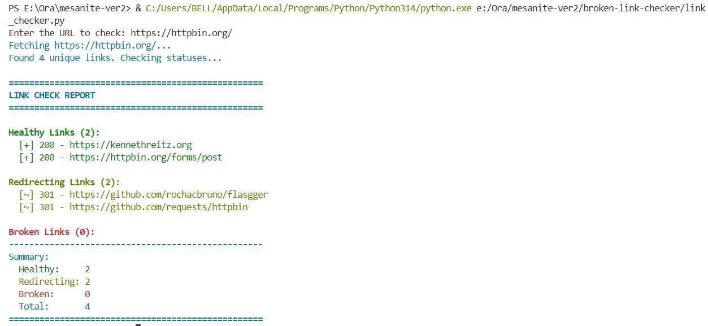

# Broken Link Checker

A Python-based tool that scans a website and identifies **healthy, redirecting, and broken links**.  
Built with both a **CLI interface** and a **web app using Streamlit**.

---

## Features

-  Crawls all internal links (one level deep)
-  Parallel link checking (multithreading)
-  Categorizes links:
  --  Healthy
  --  Redirecting
  --  Broken
-  Exports results to CSV
-  Interactive web UI using Streamlit
-  Execution time tracking

---

##  Tech Stack

- Python
- requests
- BeautifulSoup
- concurrent.futures
- Streamlit

<p align="center">
  
</p>

---

##  How to Run

### 1. Clone the repository

```bash
git clone https://github.com/solive-11/broken-link-checker-v1.git
cd broken-link-checker
```

### 2. Install dependencies

```bash
pip install -r requirements.txt
```

### 3. Run CLI version

```bash
python link_checker_advanced.py https://books.toscrape.com
```

<p align="center">
  
</p>

### 4. Run Web app

```bash
streamlit run streamlit_app.py
```

<p align="center">
  
</p>

---

##  Sample output

- Total internal links found: 73
- Healthy: 70
- Redirecting: 2
- Broken: 1

<p align="center">
  
</p>

---

##  Design decisions

- Used ThreadPoolExecutor for faster link validation (I/O bound optimization)
- Limited crawling to one level deep to avoid performance issues
- Built both CLI and Web UI for flexibility and usability

---

##  Future improvements

- Recursive crawling
- Retry mechanism for failed links
- Export to JSON/PDF
- Deployment as a hosted web service

---

##  Author
S Olive Keran, 
GitHub: https://github.com/solive-11
---